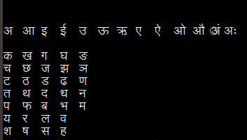

# Hindi-Varnamala

This is a python program for printing the alphabets of the Hindi language using their respective Unicode characters. 

The Unicode character range for Devanagari script is from (in hexadecimal) Ox0900 to Ox097F.

Link to their Unicode table: https://unicode.org/charts/PDF/U0900.pdf

